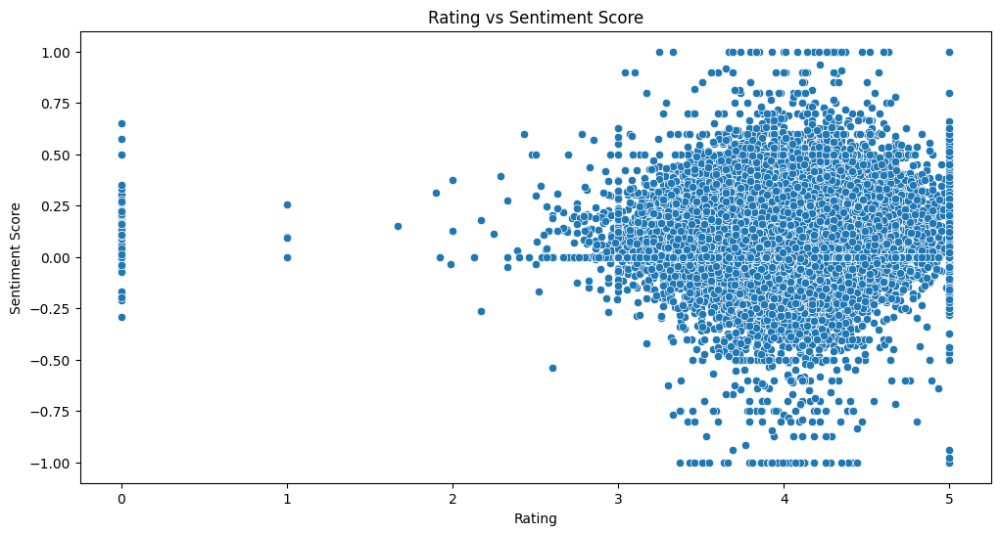

# Text Generation for Creative Writing

## Project Overview

This capstone project provides practical experience in utilizing generative AI to assist authors in the creative writing process. The project involves working with a diverse dataset of literature, including novels, poems, and articles. The primary focus is on preprocessing the dataset for text generation, analyzing its structure, implementing tokenization, addressing long-range dependencies, and ensuring diversity and coherence in the generated texts.

## Objective

The goal of this project is to explore and preprocess a dataset of existing literature to enable text generation that supports authors in their creative writing endeavors. The project aims to produce text outputs that are coherent, diverse, and creative, leveraging state-of-the-art generative AI techniques.

## Scenario

As a data scientist working with a publishing company, your task is to prepare and preprocess the company's collected dataset of literature for text generation. The project involves:

- **Dataset Collection**: Utilizing a diverse dataset of literature, including novels, poems, and articles.
- **Data Preprocessing**: Cleaning and structuring the dataset to prepare it for text generation.
- **Tokenization and Sequence Generation**: Implementing tokenization techniques and addressing long-range dependencies to ensure the generated texts are coherent.
- **Model Training**: Training a generative model capable of producing creative writing outputs.
- **Evaluation**: Assessing the quality of the generated texts based on diversity, coherence, and creativity.

## Dataset

The dataset used in this project is a diverse collection of literary works, including novels, poems, and articles. To access the dataset, [click here](<https://www.kaggle.com/datasets/thedevastator/comprehensive-literary-greats-dataset>).

### Dataset Description

The dataset includes a wide range of literary forms:
- **Novels**: Full-length fictional works.
- **Poems**: Short and long poetic compositions.
- **Articles**: Non-fictional essays, editorials, and journalistic pieces.

### Visualization

### Sentiment Analysis

